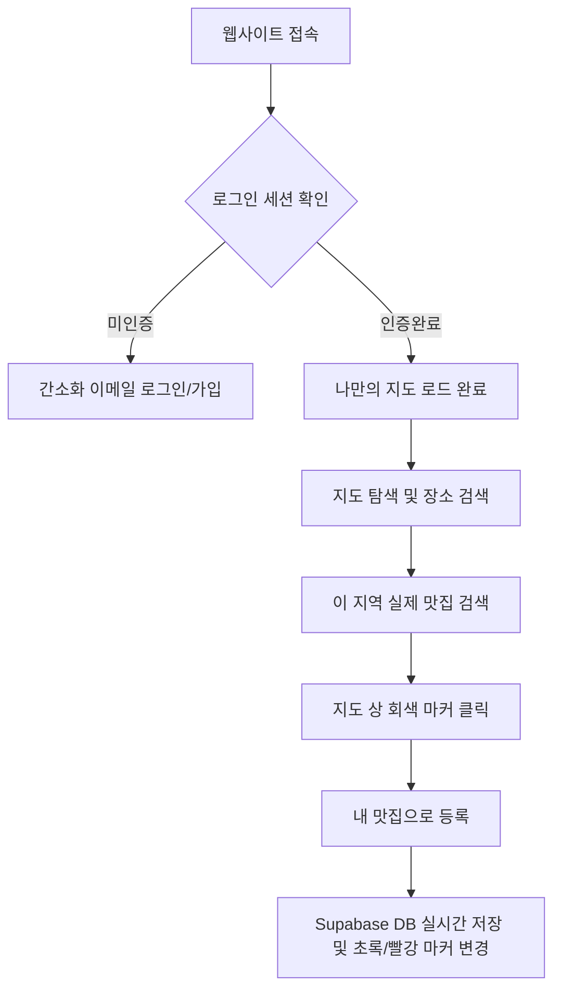
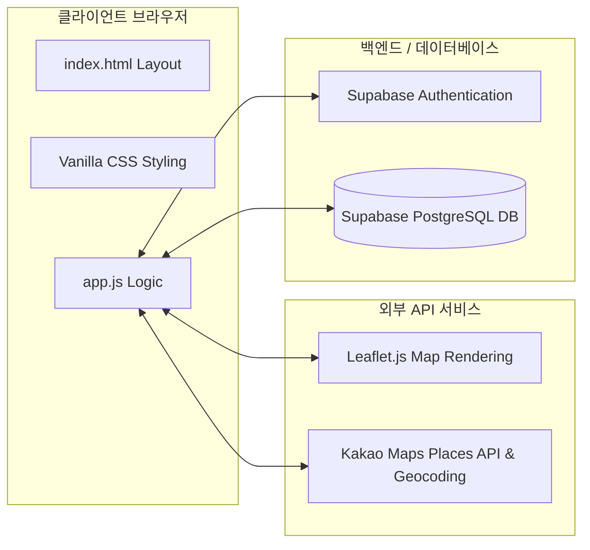

# [기획안] 나만의 식도락 지도 (Gourmet Map)

이 기획안은 개인의 맛집 발굴 경험을 실시간 데이터베이스(Supabase) 및 정밀 장소 검색 엔진(Kakao Maps API)과 결합한 프라이빗 맛집 관리 솔루션 **'나만의 식도락 지도'**의 개발 및 배포 완료 기획 문서입니다.

---

## 1. 프로젝트 개요

### 1.1. 개발 배경
*   **광고성 정보의 범람**: 기존 맛집 정보 앱(망고플레이트, 다이닝코드 등)은 대중의 평가나 마케팅 광고가 다수 포함되어 있어, 진정한 '나만의 맛집'을 별도로 기록하고 관리하기 어려움.
*   **기록의 분산화**: 인스타그램, 메모장, 네이버 지도 등으로 분산되어 있는 개인의 맛집 위시리스트와 실제 방문 경험을 통합 관리할 필요성 증대.

### 1.2. 프로젝트 목적
*   **초개인화 프라이빗 지도**: 대중의 별점이 아닌 '오직 내가 가본 곳'과 '가고 싶은 곳'만을 깔끔하게 시각화.
*   **실시간 동기화**: 모바일과 웹 어디서든 로그인 한 번으로 내가 등록한 데이터를 즉시 조회/수정할 수 있는 클라우드 연동.
*   **검색 기반의 초고속 수집**: 직접 좌표나 주소를 타이핑할 필요 없이, 실제 지도상의 매장을 클릭하여 클릭 한 번으로 모든 정보를 자동 기입 및 저장.

---

## 2. 주요 기능 및 사용자 시나리오 (User Flow)

### 2.1. 사용자 시나리오

### 2.2. 핵심 기능 정의

| 분류 | 기능명 | 상세 설명 |
| :--- | :--- | :--- |
| **인증 (Auth)** | 간소화 이메일 로그인 | 이메일 인증코드 수신 절차를 생략하고 즉시 가입 및 로그인이 이루어져 회원 이탈 및 레이트 리밋 우회 |
| **지도 (Map)** | 주소/지명 텔레포트 검색 | 지도 좌측 상단 검색바에 지명/역명 입력 시 해당 위치로 지도 중심 이동 및 하늘색 핀 마커 표시 |
| **탐색 (POI)** | 이 지역 실제 맛집 검색 | 현재 지도 범위 내 실제 음식점/카페 최대 90곳을 실시간 조회하여 미등록 업체를 회색 핀으로 표시 |
| **등록 (CUD)** | 원클릭 맛집 등록 | 회색 핀 클릭 시 상호명, 주소, 경위도, 카테고리 정보가 자동 완성된 등록 폼을 지원하여 1초 만에 등록 |
| **상세 (Read/Update)** | 인라인 실시간 편집기 | 상세 모달에서 별점 변경, 메모 수정, 방문 날짜 기입 시 저장 버튼 없이 실시간 인라인 자동 저장(Auto-save) 및 토스트 제공 |
| **시더 (Seed)** | 신규 계정 자동 시딩 | 데이터가 아예 없는 신규 계정 접속 시, 지도 중심부에 대표 서울 맛집 5곳의 기본 데이터를 자동 주입하여 첫 사용성 극대화 |

---

## 3. 시스템 아키텍처 및 연동 기술

*   **Front-end**: HTML5, Vanilla CSS, Vanilla JavaScript (No Node.js 빌드 가벼움 극대화, 모바일 웹 반응형 레이아웃 탑재).
*   **Database**: Supabase PostgreSQL 기반 실시간 DB, Row Level Security(RLS) 정책을 통해 사용자의 소유 데이터 외 타인 조회 원천 차단.
*   **Geocoding & Location Search**: 카카오 지도 SDK (Services, Places 라이브러리) 및 OpenStreetMap Nominatim API.
*   **배포 환경**: GitHub 레포지토리 연동 기반 Vercel 자동화 배포 환경 (CI/CD).

---

## 4. 기대 효과 및 발전 방향 (로드맵)

*   **개인 미식 기록의 자산화**: 방문 기록, 메모, 평점이 누적됨에 따라 개인만의 소중한 미식 포트폴리오 구축.
*   **발전 방향 (Phase 2)**:
    *   **공유 링크 생성**: 나만의 미식 지도를 카카오톡이나 SNS로 타인에게 읽기 전용으로 공유할 수 있는 기능.
    *   **태그 및 이미지 업로드**: 파일 스토리지와 연동하여 직접 촬영한 음식 사진 업로드 및 `#인생맛집`, `#데이트` 등 해시태그 분류 기능.
    *   **PWA(Progressive Web App)**: 모바일 홈 화면에 앱처럼 설치하여 모바일 편의성 극대화.
